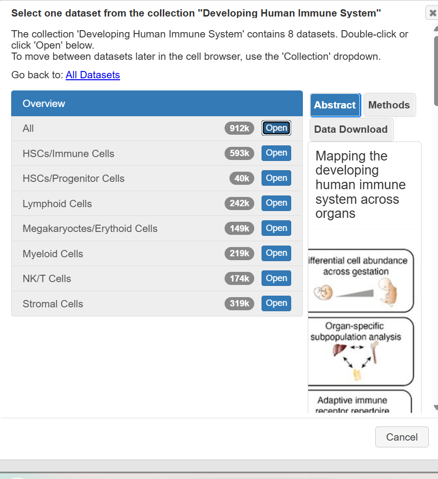
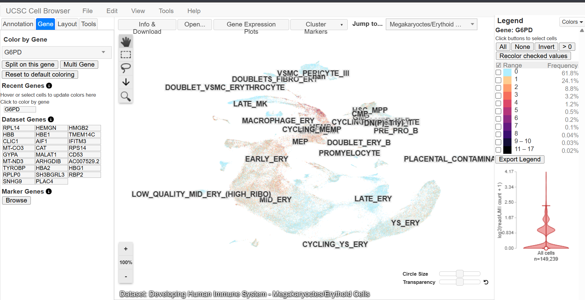
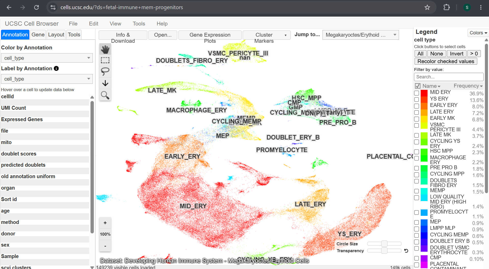
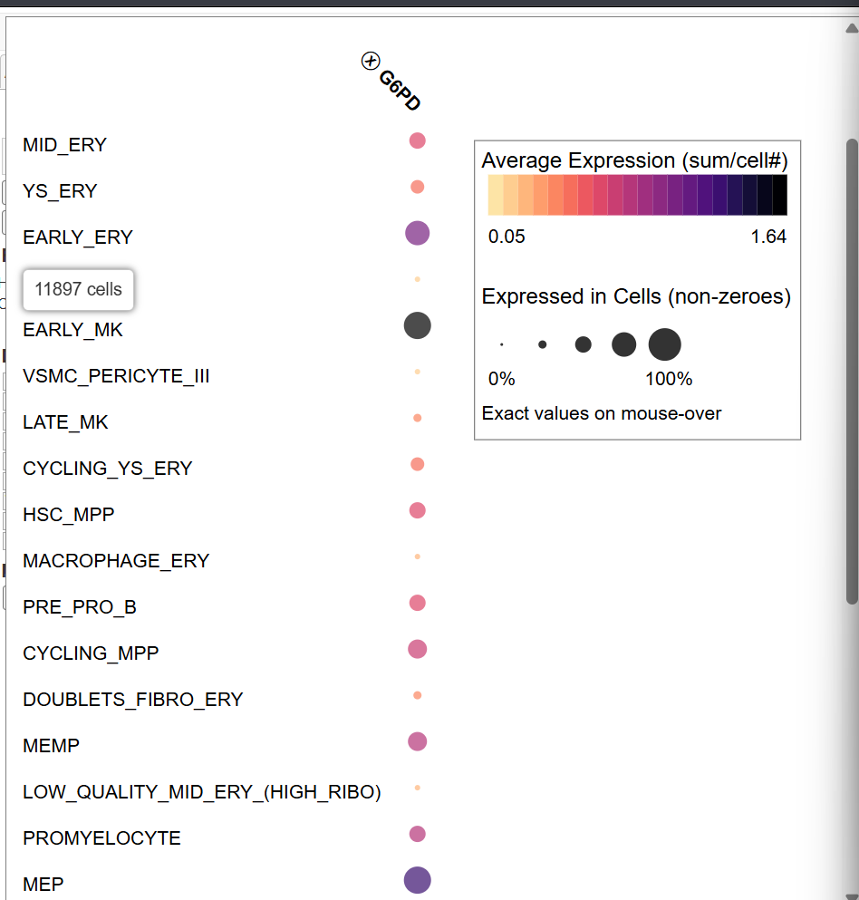
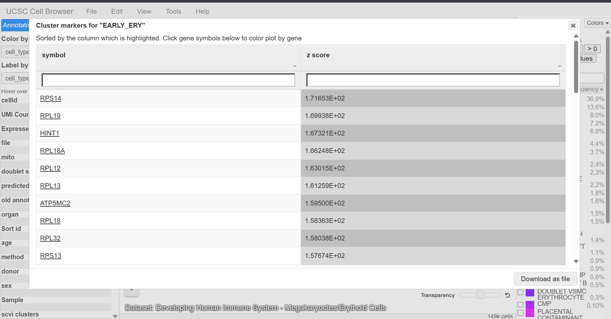

# G6PD Gene Expression Analysis Using UCSC Cell Browser

**Assigned Gene:** G6PD (Glucose-6-phosphate dehydrogenase)  
**Associated Disease:** G6PD Deficiency  
**Tool:** UCSC Cell Browser

## 1. Dataset Selection

I opened the UCSC Cell Browser and explored the available single-cell datasets. I selected the Developing Human Immune System collection and chose the Megakaryocytes/Erythroid Cells dataset because it contains developing red blood cells, which are relevant to G6PD deficiency.

- **Dataset:** Developing Human Immune System – Megakaryocytes/Erythroid Cells
- **Total cells:** 149,239
- **Gene analyzed:** G6PD

## 2. G6PD Gene Expression

I selected the Gene tab and searched for G6PD to visualize its expression across the different cell populations.

The expression map showed that G6PD was detected in approximately 38.2% of cells, while 61.8% had no detected expression. The expression levels varied across the different cell clusters.

## 3. Cell Types and Clusters

I used the Annotation tab and selected cell_type to visualize the different cell populations.

The dataset contained several erythroid populations, including EARLY_ERY, MID_ERY, LATE_ERY, and YS_ERY. Other cell types included hematopoietic stem and progenitor cells, megakaryocytes, and macrophage-related populations.

## 4. Gene Expression Dot Plot

I opened Gene Expression Plots and selected G6PD to compare its expression across cell types.

The dot plot showed that G6PD expression varied between cell populations. EARLY_ERY showed a stronger expression signal than LATE_ERY. G6PD was also detected in megakaryocyte and hematopoietic progenitor populations.

In the dot plot, the color represents average gene expression, while the dot size represents the proportion of cells expressing the gene.

## 5. Cluster Marker Genes

I opened the Cluster Markers feature and examined the marker genes for EARLY_ERY.

Some of the marker genes displayed were:

| Gene | Z-score |
|---|---|
| RPS14 | 171.65 |
| RPL19 | 169.94 |
| HINT1 | 167.32 |
| RPL18A | 166.25 |
| RPL12 | 163.02 |

These genes were listed among the highest-scoring markers for the EARLY_ERY cluster in this dataset.

## 6. Interpretation

The UCSC Cell Browser helped me visualize how G6PD expression differs across developing blood cell populations. I observed that G6PD expression was more prominent in some early erythroid and progenitor populations than in late erythroid cells.

Since G6PD is important in protecting red blood cells from oxidative stress, examining its expression in erythroid populations is relevant to understanding G6PD deficiency. However, gene expression alone cannot determine whether a cell has normal G6PD enzyme activity.

## 7. References

- [UCSC Cell Browser](https://cells.ucsc.edu/)
- [UCSC Cell Browser Visualization Guide](https://cellbrowser.readthedocs.io/en/master/ui/visualization.html)
